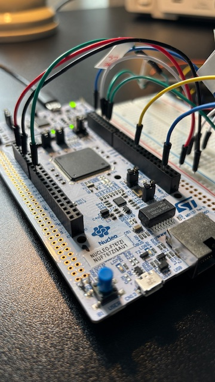
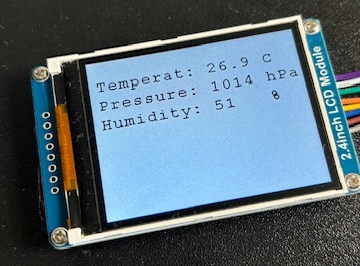
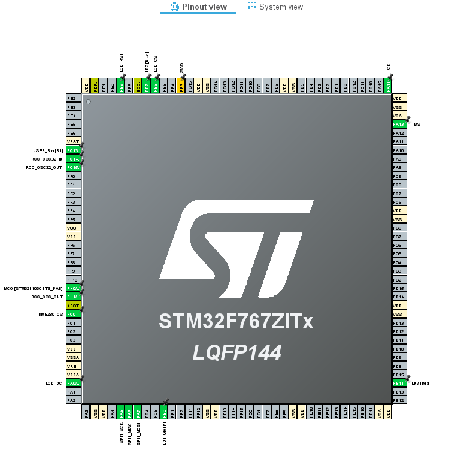
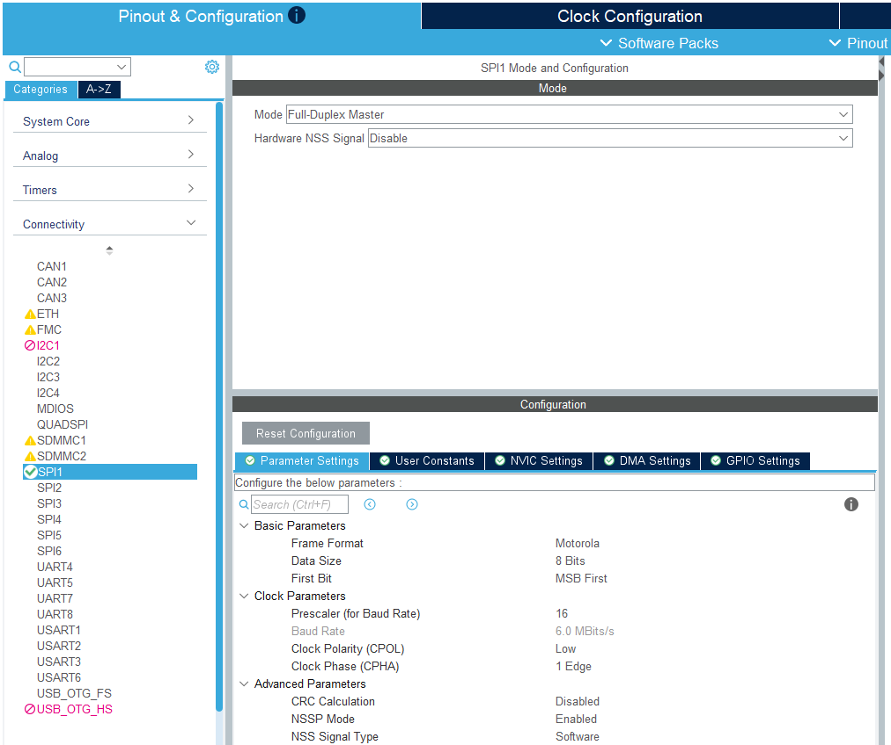
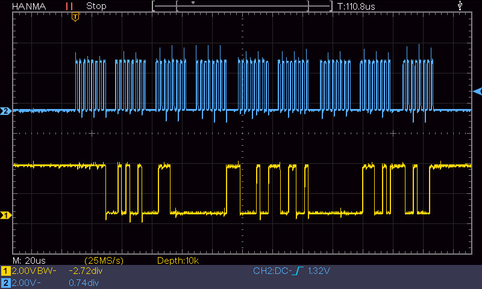

BME280 sensor data (temperature, air pressure, and humidity) displayed on the Waveshare ILI9341 LCD by the STM32F767ZI. The drivers are fully configured using STM32CubeMX. The IDE used for building and debugging is STM32CubeIDE.

Connections (https://os.mbed.com/platforms/ST-Nucleo-F767ZI/)

| LCD      | Port     | Function     |
|----------|----------|------------- |
| VCC      | 3,3V     | Vcc          |
| GND      | GND      | GND          |
| DIN      | PA7      | SPI1_MOSI    |
| CLK      | PA5      | SPI1_CLK     |
| CS       | PB6      | Chip Select  |
| DC       | PA0      | Data/Command |
| RST      | PB9      | Reset        |
| BL       | -        | Backlight    |

| BME280   | Port     | Function     |
|----------|----------|--------------|
| VCC      | 3,3V     | Vcc          |
| GND      | GND      | GND          |
| SCK      | PA5      | SPI1_CLK     |
| MOSI     | PA7      | SPI1_MOSI    |
| MISO     | PA6      | SPI1_MISO    |
| CS       | PC0      | Chip Select  |

Hardware

BME280: https://seengreat.com/product/207/bme280-environmental-sensor?srsltid=AfmBOorvlymsT9w0Ea-JBnftBbgADYcXMKpadnPHUyHl7X1wOO5TTgUa

LCD: https://www.waveshare.com/wiki/2.4inch_LCD_Module?srsltid=AfmBOoqtv3bq-mZfPtsi2BxiewwQnIkomXrloIzpVwGw_HnrOcmvQZar

Nucleo-STM32767ZI: https://www.st.com/en/evaluation-tools/nucleo-f767zi.html
